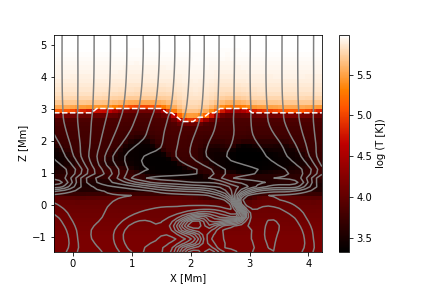

# RAMENS_py
Python code for analyzing the result of RAMENS. This code is based on dac_read.py of CANS+(http://www.astro.phys.s.chiba-u.ac.jp/cans/doc/).

## Usage example

```python
import numpy as np
from readRamens import *

# Load variables 
filename='ramens/dac_s/qq.0???.*.dac'
x,y,z,data=readRamens2d(direction,file)
t=-1
te=data['te'][t,:,:]
bx=data['bx'][t,:,:]
by=data['by'][t,:,:]
bz=data['bz'][t,:,:]

fig=plt.figure()
ax1=fig.add_subplot(1,1,1)
ax1.set_xlabel('X [Mm]')
ax1.set_ylabel('Z [Mm]')

# Temperature distribution
im=ax1.pcolormesh(x/l,z/l,np.log10(te),cmap='gist_heat')
plt.colorbar(im,ax=ax1,label='log (T [K])')

# Location of the transition region 
te1=te[1:,:]
te2=te[:-1,:]
dtedz=te1-te2
arr=np.argmax(dtedz,axis=0)
ax1.plot(x/l,z[arr]/l,c='w',linestyle='--')

# Draw magnetic field lines
ay=ff(x,y,z,bx,by,bz,'y')
l=1e8
ax1.contour(x/l,z/l,ay,20,colors='gray',linestyles='solid')
```

